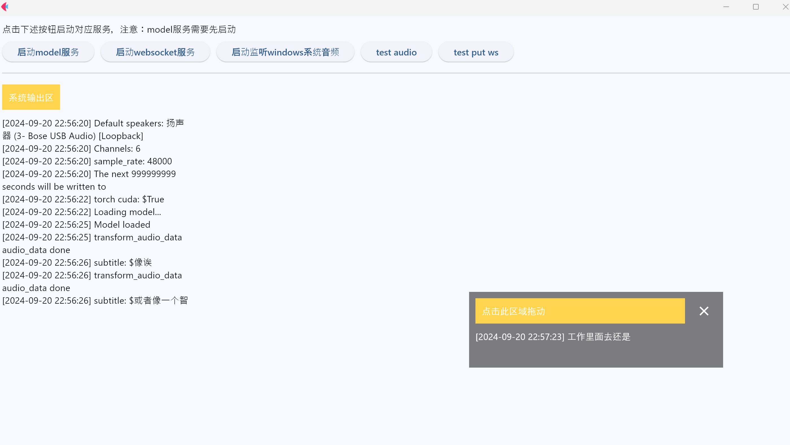

# 基于whisper的实时语音识别 网页和桌面客户端


## 效果演示




#### 模型+网页+websocket
https://github.com/user-attachments/assets/6748f490-06ed-480f-8d79-d397197e385e


<video width="320" height="240" src="https://github.com/Relsoul/whisper-win-gui/raw/master/docs/webandws.mp4" controls>
 
</video>

#### 模型+桌面客户端

https://github.com/user-attachments/assets/e169c026-f8bc-41eb-bf4f-513365c87242

<video width="320" height="240" src="https://github.com/Relsoul/whisper-win-gui/raw/master/docs/win_audio.mp4" controls>
  
</video>


## 安装

python版本要求>3.11(其他版本未测试)


## 支持系统及环境

不开启系统音频监听，只开启模型服务和websocket服务理论上支持其他平台，开启系统音频监听只适用于windows平台
由于实时语音识别比较消耗gpu，目前使用的cn larger v3模型需要大概9gb显存，纯cpu推理很慢（可以尝试替换小模型或者量化模型等），建议使用gpu

## 功能

- [x] 实时语音识别
- [x] 实时语音识别结果展示
- [x] 实时语音识别结果websocket推送
- [x] 系统音频监听(windows)
- [x] 网页video websocket推送及字幕功能


### 1.安装依赖


#### cpu版本
```bash
pip install numpy PyAudioWPatch soundfile transformers torch torchvision torchaudio scipy pydub transformers websockets datasets flet
```

如果你有cuda，可以安装torch cuda，这样速度会更快，详情请参考[torch官网](https://pytorch.org/get-started/locally/)，下载安装对应的cuda torch

#### 安装ffmpeg
```
# on Windows using Chocolatey (https://chocolatey.org/)
choco install ffmpeg

# on Windows using Scoop (https://scoop.sh/)
scoop install ffmpeg
```

### 2.下载模型

这里推荐 [BELLE-2/Belle-whisper-large-v3-zh](https://huggingface.co/BELLE-2/Belle-whisper-large-v3-zh/tree/main)


下载完成后，复制所有文件放在`wmodel`目录下

### 3. 运行

```bash
python window_gui.py
```


### 4. 网页端

进去js目录，打开f12,复制main.js内容，粘贴到控制台，回车

## 问题&roadmap

- 由于使用线程做处理，可能某些情况下(没有音频播放和音频数据)会导致音频队列处理不及时，会卡一下，可能后续版本迭代会解决
- 系统音频监听只支持windows
- js脚本目前是获取页面的video标签，有需要可以自行更改，后续待优化整合进油猴
```
const videoElement = document.querySelector("video");
```
- oonx模型等量化模型后续迭代支持
- input mp4 or audio file 支持

## 后续

练手作，欢迎提issue和pr，另外创建了个交流群，本人是前端领域工程师，现在在了解学习ai相关知识，欢迎大佬们进来指点指点。如果有相关合作小项目也可以考虑一起研发~


